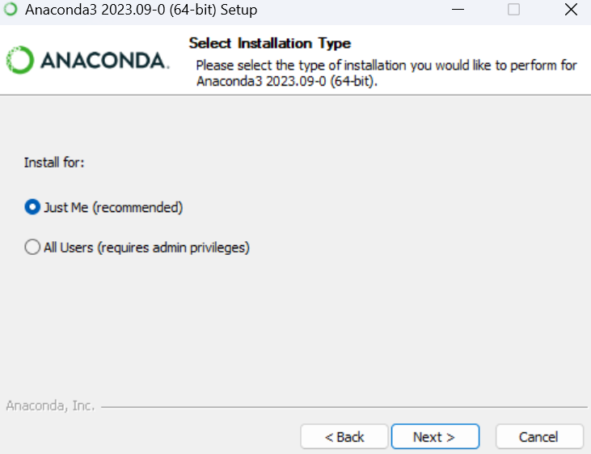
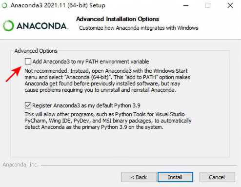
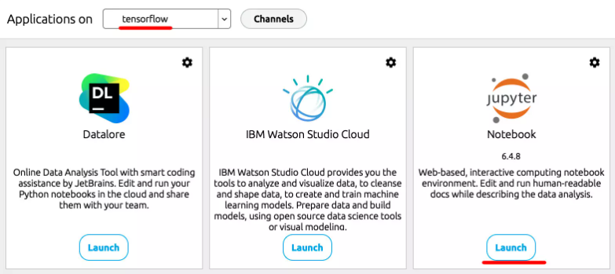

# AI-image-recognition

## 設置環境
### 1.下載Anaconda (方便之後使用)
#### 首先你需要安装 [Anconda](https://www.anaconda.com/)，點擊 [download](https://www.anaconda.com/download)。選擇對應的系统和版本類型。
* 選擇Just Me
#### 
* 注意! 如果是 Windows，安裝過程中「不用勾選」Add Anaconda3 to my PATH 的選項 ( 下方截圖為 Windows 環境 )。
#### 

#### 在cmd中輸入`conda -V`確認已經安裝。

### 2.安裝Keras
* 建立名為 tensorflow 的虛擬環境
##### > `conda create --name tensorflow python=3.11`
* 啟動虛擬環境
#### > `conda activate tensorflow`
* 安裝 Jupyter
#### > `conda install jupyter notebook`
* 安裝 tensorflow
#### > `pip install tensorflow`
* 安裝 OpenCV 和 OpenCV 進階套件
#### > `pip install opencv-python`
#### > `pip install opencv_contrib_python`
* 開啟 Anaconda，進入 tensorflow 虛擬環境，啟動 Jupyter
#### 